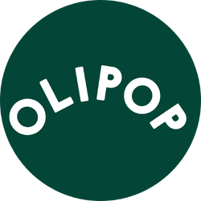

<div align="center">
  

  <h1>Soda App</h1>
  <p><strong>A colourful, OLIPOP-inspired soda landing page.</strong></p>
  <p>Built with React 19 · TypeScript 6 · Vite 8 · CSS Modules</p>

  <p>
    <a href="#getting-started">Getting Started</a> ·
    <a href="#features">Features</a> ·
    <a href="#available-commands">Commands</a> ·
    <a href="#project-structure">Project Structure</a>
  </p>
</div>

---

## About the project

Soda App is a frontend project that recreates the look and feel of a soda brand's promotional website. It brings together bold typography, colourful product imagery, flavour cards, and subscription messaging in a single-page experience.

The application uses reusable React components, TypeScript, and component-scoped CSS. Images and custom fonts are included in the repository.

## Features

- **Product-led hero section** featuring Strawberry Vanilla and a shopping call to action.
- **Brand introduction** with an ingredients story and supporting imagery.
- **Flavour showcase** featuring Ginger Lemon, Classic Grape, Orange Squeeze, and Tropical Punch.
- **Subscription benefits section** with savings, shipping, and flexibility messaging.
- **Responsive styling** with media queries for smaller screens and a toggleable mobile navigation menu.
- **Footer** containing an email input, flavour information, and social links.
- **Reusable UI components** for buttons, text, inputs, and content containers.

### Current functionality

This version is a responsive frontend showcase. Navigation and hero links jump to page sections. The mobile menu supports keyboard activation and Escape to close. Products display prices without a checkout. The email area is labelled as a preview and its subscription button is disabled until a service is connected. Email addresses are not saved.

No backend server, database, API keys, or `.env` file is required to run the current app.

## Tech stack

| Technology | Purpose |
| --- | --- |
| React 19 | Component-based user interface |
| TypeScript 6 | Typed application code |
| Vite 8 | Development server and production bundling |
| CSS Modules | Component-scoped styling |
| ESLint 10 | Code linting |
| npm | Dependency installation and project commands |

## Getting started

### 1. Install the prerequisites

You will need:

- **Node.js 24.x** with npm. This version satisfies the Node engine requirements recorded in the project's lockfile.
- **Git**, if you want to clone the repository.
- A web browser and a code editor of your choice.

Check that Node.js and npm are available:

```sh
node --version
npm --version
```

### 2. Open the project

Clone the repository and enter the application folder:

```sh
git clone https://github.com/Kgwale-NN/soda-app.git
cd soda-app
```

If you already have the project on this Windows computer, open PowerShell and use:

```powershell
cd "C:\Users\LEARNER\Documents\mlab\task-1\soda-app"
```

> Run all commands below inside `soda-app`, the folder containing `package.json`.

### 3. Install dependencies

```sh
npm ci
```

This installs the dependency versions recorded in `package-lock.json`, making setup reproducible. Use `npm install` when intentionally adding or updating dependencies, and keep the resulting lockfile changes with your code.

### 4. Start the application

```sh
npm run dev
```

Open the local URL printed in the terminal, usually:

```text
http://localhost:5173
```

Vite updates the page as you edit and save source files. If the default port is busy, use the URL Vite prints instead. Press **Ctrl+C** in the terminal to stop the server.

## Available commands

| Command | Description |
| --- | --- |
| `npm ci` | Install dependencies using the existing lockfile |
| `npm run dev` | Start the development server |
| `npm run build` | Run the TypeScript build, then create a production bundle |
| `npm run preview` | Serve the production bundle locally for review |
| `npm run lint` | Run ESLint against the project |

There is currently no automated test command configured in `package.json`.

## Production build

Create the production bundle:

```sh
npm run build
```

Once the build succeeds, Vite places the bundled website in `dist/`. Preview it locally:

```sh
npm run preview
```

Open the URL printed in the terminal. Preview serves the built files, so run the build again after making changes you want to review.

For static hosting, use these project settings:

| Setting | Value |
| --- | --- |
| Project root | The directory containing `package.json` (`soda-app` in the local task folder) |
| Install command | `npm ci` |
| Build command | `npm run build` |
| Publish/output directory | `dist` |

The preview command is intended for local verification. Publish the contents of `dist/` through your static hosting service. If hosting under a URL subdirectory, configure Vite's `base` setting in `vite.config.ts` and review the root-relative navigation links before building.

## Project structure

```text
soda-app/
├── public/                      # Static public assets
├── src/
│   ├── assets/                  # Product images, logos, icons, and fonts
│   ├── Components/
│   │   ├── Auth/                # Subscription input and button layout
│   │   ├── Body/                # Hero, ingredients, products, and benefit sections
│   │   ├── Footer/              # Footer layout and social links
│   │   ├── Inputs/              # Shared button and text-input components
│   │   ├── Navbar/              # Navigation and mobile menu
│   │   ├── Text/                # Shared typography component
│   │   └── ContentContainer.tsx # Shared content wrapper
│   ├── App.tsx                  # Assembles the page sections
│   ├── App.css                  # Application layout styling
│   ├── index.css                # Global styles
│   └── main.tsx                 # React entry point
├── index.html                   # HTML entry document
├── eslint.config.js             # ESLint configuration
├── package.json                 # Dependencies and npm scripts
├── package-lock.json            # Locked dependency versions
├── tsconfig*.json               # TypeScript configuration
├── vite.config.ts               # Vite configuration
└── README.md
```

## Customising the app

| To change… | Start here |
| --- | --- |
| Page composition | `src/App.tsx` |
| Hero text and featured image | `src/Components/Body/FirstContent.tsx` |
| Ingredients story | `src/Components/Body/SecondContainer.tsx` |
| Flavours, images, and displayed prices | `src/Components/Body/ThirdContainer.tsx` |
| Subscription benefits | `src/Components/Body/FourthContainer.tsx` |
| Subscription promotion | `src/Components/Body/FifthContainer.tsx` |
| Navigation links and mobile menu | `src/Components/Navbar/Navbar.tsx` |
| Footer content and social links | `src/Components/Footer/Footer.tsx` |
| Subscription form layout | `src/Components/Auth/Subscribe.tsx` |
| Section colours, spacing, and responsive layouts | `src/Components/Body/Body.module.css` |
| Global styles and fonts | `src/index.css` and `src/assets/fonts/` |

Most component folders include their own `.module.css` file. Update those files when changing the appearance of a specific component.

## Troubleshooting

| Problem | What to do |
| --- | --- |
| `node` or `npm` is not recognised | Install Node.js with npm, then reopen your terminal. |
| PowerShell blocks `npm.ps1` | Use `npm.cmd ci` or `npm.cmd run dev` in place of the corresponding `npm` command. |
| npm cannot find `package.json` | Check that your terminal is inside the `soda-app` folder. |
| Unsupported Node engine warning | Check `node --version` and use Node.js 24.x for this project. |
| Dependencies are missing | Run `npm ci` from the application folder. |
| The default development URL does not work | Open the exact URL printed by Vite; it may be using a different port. |
| Production preview is missing or out of date | Run `npm run build` successfully before `npm run preview`. |
| A build or lint command fails | Read the reported file and line number, fix the issue, and rerun that command. |
| A shopping or subscription button does nothing | These controls are currently placeholders; connect the intended behaviour in the component. |

## Development checks

Before submitting changes, run:

```sh
npm run lint
npm run build
```

Then check the page in a browser at desktop and mobile widths, including the navigation toggle, product layout, images, and footer. These are the project's verification commands; this README does not imply that the current code passes them.

## Possible next steps

- Connect shopping buttons to product pages and a cart.
- Add email validation and a subscription service.
- Improve keyboard access and accessible labels for interactive controls.
- Add automated tests for navigation and form behaviour.

## Credits and licence

This project uses OLIPOP branding and product imagery as part of its visual design. Those brand assets belong to their respective owners.

No licence file is currently included in the repository. Add an appropriate licence before distributing the project under specific reuse terms.
